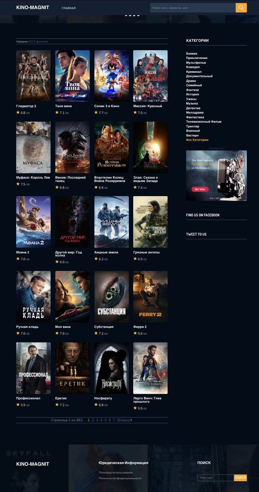
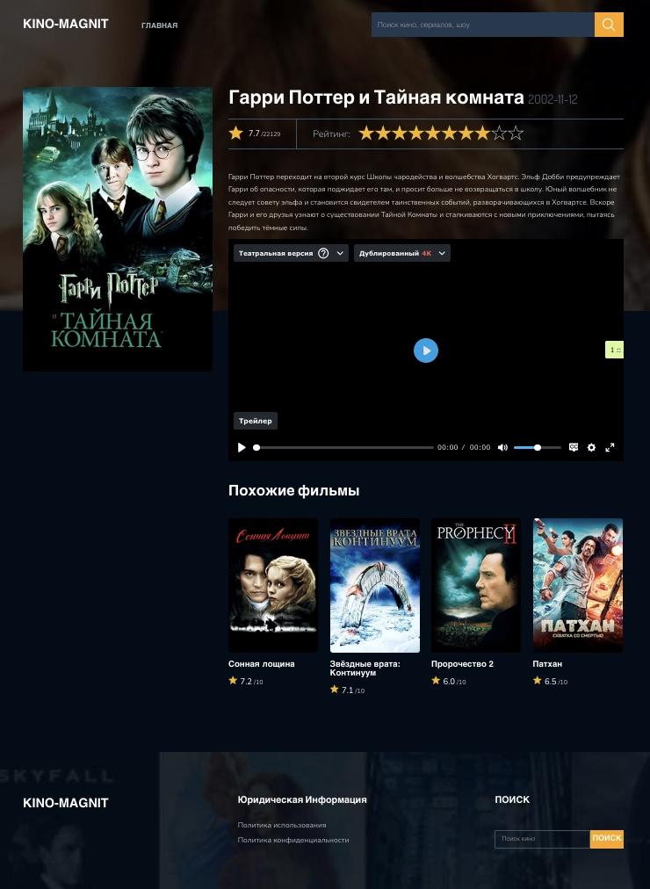

# KinoSite - Movie Website






Kino is a Node.js-based website built using Express.js, Handlebars (HBS) as the templating engine, and MySQL as the database. This project provides APIs to manage genres, popular movies, and the latest movies.

## Prerequisites

Before running the project, ensure the following are installed on your system:

- [Node.js](https://nodejs.org/) (v14 or later)
- [MySQL](https://www.mysql.com/)

## Setup Instructions

1. Clone the repository:
   ```bash
   git clone <repository_url>
   cd kinosite
   ```

2. Install dependencies:
   ```bash
   npm install
   ```

3. Create a `.env` file in the root directory with the following variables:
   ```env
   DB_HOST=127.0.0.1:3306
   DB_USER=root
   DB_PASSWORD=your_password
   DB_NAME=kino
   DB_CHARSET=utf8mb4
   PORT=3000
   ```

4. Set up the MySQL database:
   - Create a database named `kino`.
 
5. Start the application:
   ```bash
   npm start
   ```
			or in dev mode 
         
	```bash
   npm run dev
   ```

6. Open your browser and navigate to `http://localhost:3000`.

## API Endpoints

### Save All Genres
- **URL**: `/api/genres/all-save`
- **Method**: `GET`
- **Description**: Fetches and saves all genres to the database.

### Save Popular Movies
- **URL**: `/api/movies/save-popular`
- **Method**: `GET`
- **Description**: Fetches and saves popular movies to the database.

### Get and Save Latest Movies
- **URL**: `/api/movies/get-and-save-last-movies`
- **Method**: `GET`
- **Description**: Fetches and saves the latest movies to the database.

## SEO-Friendly Features

- **Clean URL Structure**: URLs for APIs and pages are designed to be clean and readable by search engines.
- **Meta Tags**: Proper meta tags for titles, descriptions, and keywords are included for all pages.
- **Fast Loading**: Optimized for performance to ensure fast loading times, a critical factor for SEO ranking.
- **Responsive Design**: Works seamlessly across desktop and mobile devices, improving user experience and SEO.
- **Sitemap**: A dynamically generated sitemap helps search engines crawl and index the website efficiently.


## File Structure

```
├── app.js              # Main application file
├── routes/             # API route handlers
├── views/              # Handlebars templates
├── public/             # Static files (CSS, JS, images)
├── models/             # Database models
├── .env                # Environment variables
└── 
```

## Additional Notes

- In the 'moviesData' folder you will find a json with movie IDs. You can update it. Download a new file from here. It only stores files from the last 90 days. Use today's date!

- **URL**: `http://files.tmdb.org/p/exports/movie_ids_12_15_2024.json.gz`

- Ensure the MySQL service is running before starting the application.
- Modify the `.env` file to reflect your database credentials.
- TMDB_API_KEY you can find here **URL**: `https://www.themoviedb.org/settings/api`
- The application follows SEO best practices to ensure better search engine visibility.
